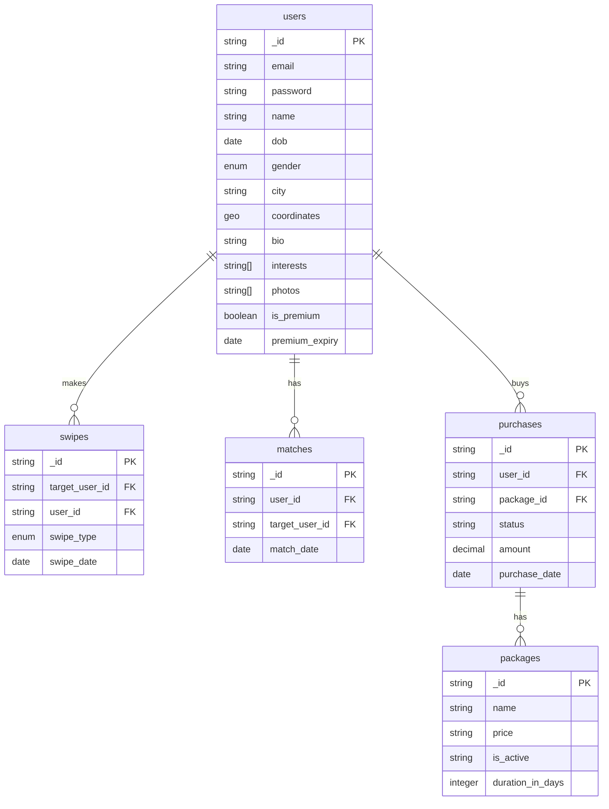
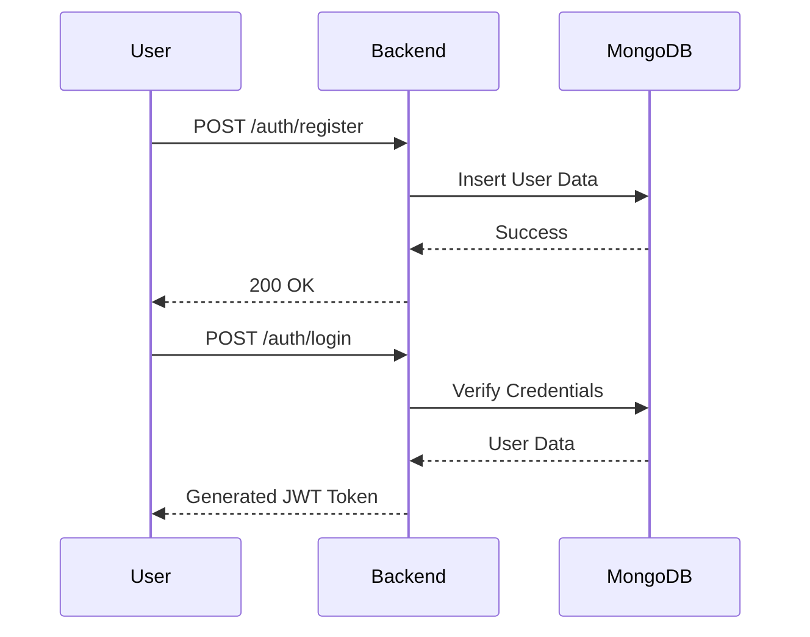
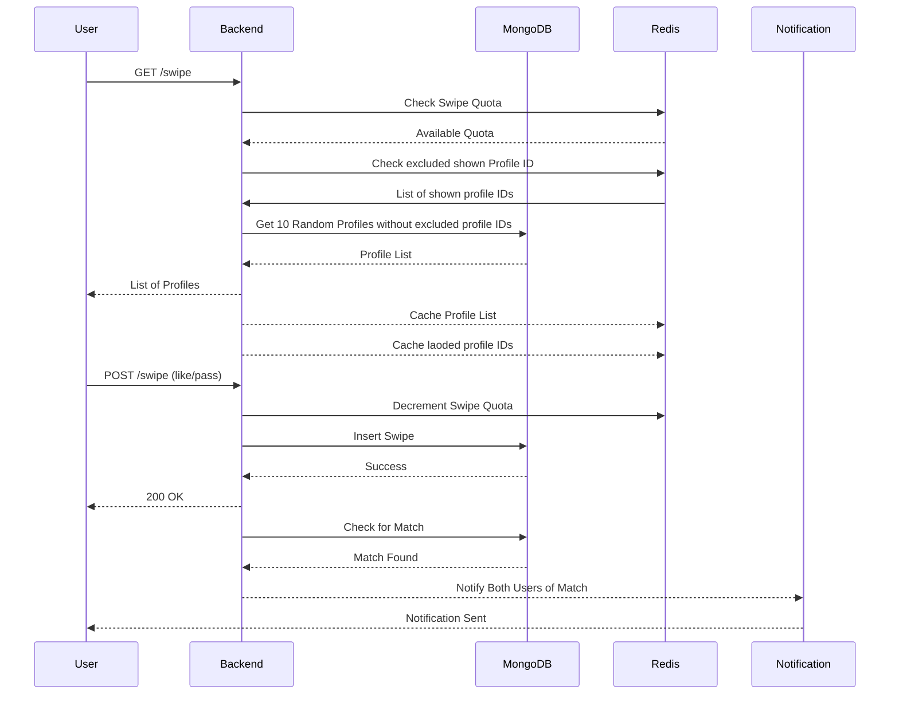
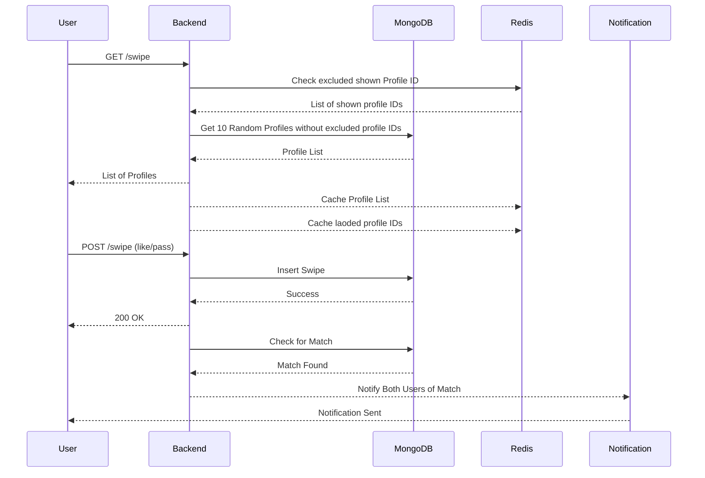
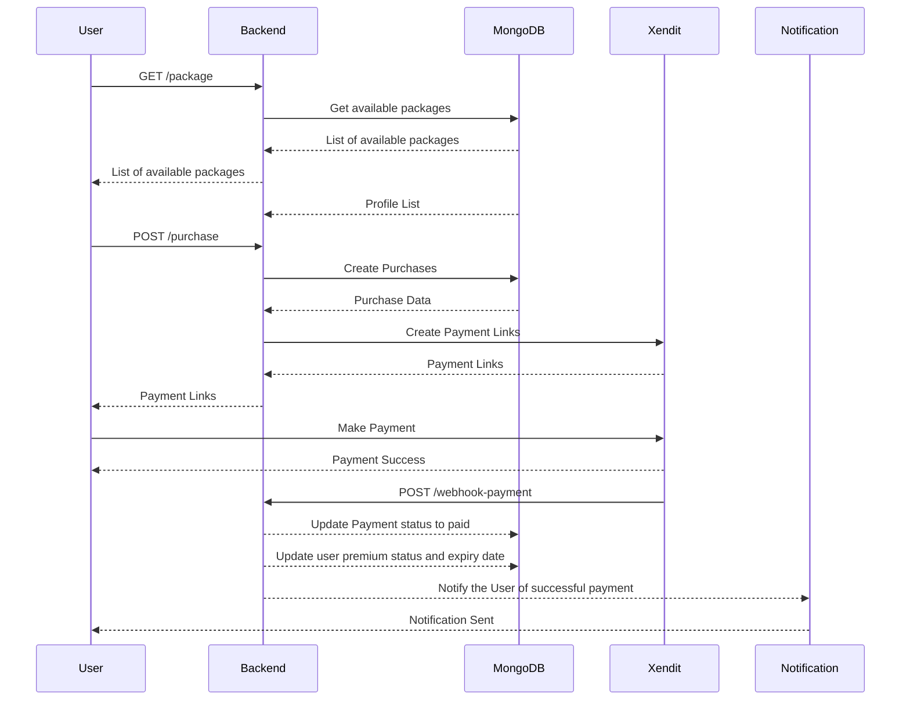

# Dating App Backend Design - Ahmad Hafizh Muttaqi

## Table of Contents

- [Github Link for 1st Test](#github-link)
- [Functional Requirements](#functional-requirements)
- [Non-Functional Requirements](#non-functional-requirements)
- [Tech Stack](#tech-stack)
- [System Design](#system-design)
  - [ERD Diagram](#erd-diagram)
  - [Sequence Diagram](#sequence-diagram)
- [Test Cases](#test-cases)

## Github Link
Here is my Github link for 1st test : [Link](https://github.com/ahmadhafizh16/usedeall-be-test)

## Functional Requirements

1. **User Authentication**
   - Users can sign up and log in using either their email and password or by connecting their Google/Facebook accounts.
   - We use JWT tokens to manage user sessions.

2. **Profile Viewing and Swiping**
   - Users get to view 10 profiles a day and can swipe right (like) or left (pass) on them.
   - No profile can show up more than once in a single day, We will use redis to store user profile ID to exclude that in next query.

3. **Swipe Quota**
   - Each user is limited to swiping a total of 10 times (likes + passes) in a 24-hour period.

4. **Premium Package**
   - Premium users enjoy the perk of no daily swipe limit.
   - Users can buy premium packages to unlock the unlimited swipe feature, which lasts for a month.
   - The premium will be automatically expired after 1 month if the premium package is not extended by the user.

5. **Matches**
   - A match happens when both users swipe right (like) on each other.
   - When a match occurs, both users get notified and can start chatting, regardless of gender.

6. **User Profile**
   - Users can create and update their profiles, including name, bio, photos, location, and interests.

7. **Notification on Match**
   - If two users like each other, both are notified about the match through in-app notifications.

## Non-Functional Requirements

1. **Scalability**:
   - We want our system to handle loads of users—think thousands or even millions! So, we’ll use cloud services that easy to scale horizontally and vertically like AWS or Kubernetes to scale up when needed.

2. **Performance**:
   - Our goal is to keep response times under 200ms for important actions like loading profiles and processing swipes, even during peak times. We’ll use Redis for caching user profile to keep things running smoothly and also will reduce read action to database.

3. **Security**:
   - User passwords will be encrypted using bcrypt for password hashing. We'll use HTTPS for secure communication, and JWT for authentication.

4. **Availability**:
   - We aim for **99.9% uptime**. Our deployment strategy will involve cloud solutions with auto-scaling and load balancing so users have a seamless experience.

5. **Maintainability**:
   - The code should be easy to manage and follow best practices, using clean architecture and SOLID principles. Good documentation will help new developers jump in easily. I would recommend to adopt the Porto Software Design Pattern for this one.

6. **Reliability**:
   - We want our system to bounce back quickly from failures. So, we’ll have backup plans in place and use retry strategies for any failed transactions.

7. **Extensibility**:
   - The design will allow us to add new features easily in the future, whether that’s chat functionality, profile boosting, or advanced matching algorithms.

8. **Monitoring and Logging**:
   - We’ll set up monitoring tools (like **Grafana** and **Sentry**) to keep an eye on system health and performance. Logs will help us troubleshoot any issues that pop up.

## Tech Stack

1. **Backend Framework**: 
   - **NestJS**: A cool Node.js framework that helps us build scalable and maintainable server-side applications. It’s got great support for modular architecture and TypeScript. JavaScript particularly, utilizes an event-driven, non-blocking I/O model. This is particularly beneficial for applications that require real-time interactions, such as swiping and messaging features in a dating app. It allows the server to handle multiple requests simultaneously without being blocked by slow operations (like database queries).

2. **Database**:
   - **MongoDB**: A NoSQL database that lets us store user profiles flexibly. Since user data can be pretty dynamic (everyone has different interests and preferences), MongoDB’s schema-less nature is perfect. Plus, it scales well, which is a must for a dating app. The **Geospatial Queries** in mongodb is more suited for Dating app compared to PostgreSQL since we mostly need it to find users within a certain radius of a location and sort users by distance from a given point.

3. **Authentication**:
   - **JWT (JSON Web Tokens)**: A lightweight method to handle user authentication across devices.

4. **Payments**:
   - **Xendit**: The go-to for managing in-app purchases, like premium subscriptions. Reliable enough based from my personal experience, even though the Auto debit for Subcriptions feels like beta feature.

5. **Cache**:
   - **Redis**: We’ll use it to store swipe quotas and speed things up by caching data that gets accessed often like users profile. Also we can use Redis Pub/Sub if we still use simple messaging system before we move to Kafka or RabbitMQ. 

6. **Cloud Platform**:
   - **AWS (Amazon Web Services)**: We’ll use AWS services for hosting our servers and storing images.
   - **Firebase Cloud Messaging**: We'll use FCM to deliver real-time notifications for our users.

7. **Testing**:
   - **Jest**: A testing framework for writing all kinds of tests—unit, integration, and end-to-end.

8. **API Documentation**:
   - **Swagger**: To help document and test our REST API.

## System Design

### ERD Diagram

### Sequence Diagram

#### User Registration and Login

#### Swiping and Matching For Free Users

#### Swiping and Matching For Premium Users

#### User Purchases Premium

### Test Cases

1. **User Sign Up**
   - Check if a user can successfully register with valid credentials.
   - Check users age must not below the minimum age.
   - Make sure duplicate email registrations get rejected.
   
2. **User Login**
   - Test that a user can log in with valid credentials.
   - Ensure that wrong passwords lead to failed logins.

3. **Swipe Functionality**
   - Verify that users can view up to 10 profiles in a 24-hour period.
   - Ensure the daily limit is enforced for standard users, while premium users have no limits.
   - Confirm that users don’t see the same profile more than once in a day.
   - Check the functionality for both like and pass swipes.

4. **Match Creation**
   - Verify that a match is created when two users like each other.
   - Make sure both users are notified when a match happens.
   
5. **Premium Features**
   - Test that buying a premium package removes the daily swipe limit for
   - Test buying premium without checkout after payment expire will not upgrade user to premium